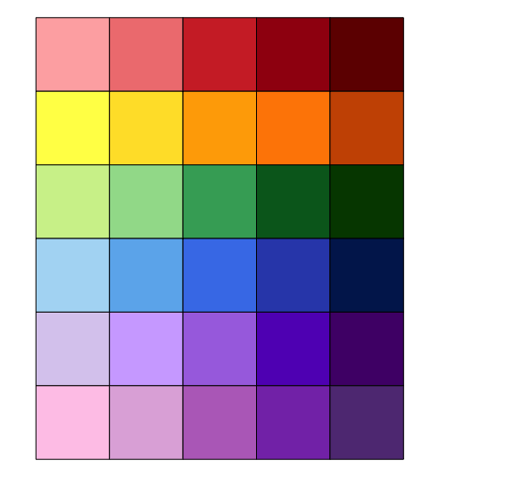
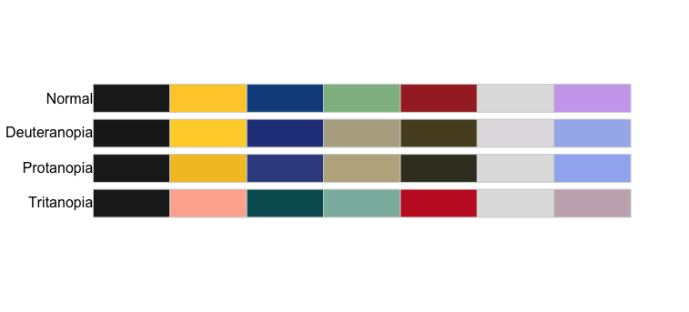
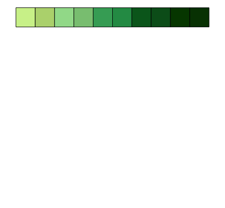

# callettes

`ggplot2` theme following the [visual identity of SU](https://www.su.se/medarbetare/kommunikation/grafisk-manual)

## Install package

``` r
#install.packages("devtools")
devtools::install_github("borstell/callettes")
library(callettes)
```

## Color palettes

### Basic rainbow palette
``` r
scales::show_col(callettes$rainbow, ncol=5)
```



### Basic colorblind-friendly palette
```r
scales::show_col(callettes$friendly, ncol=7)
```


### Expanded color palette
``` r
scales::show_col(expand_palette(callettes$green, amount = -.1), ncol=10, labels=F)
```

